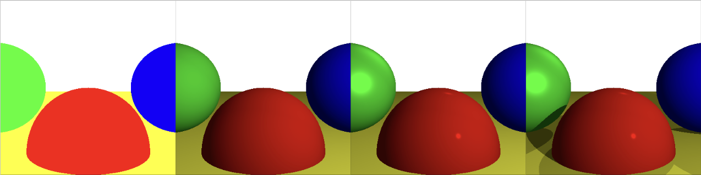
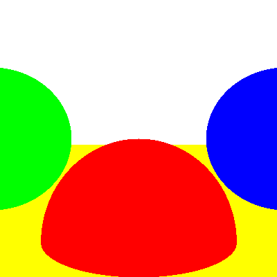
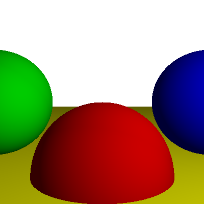
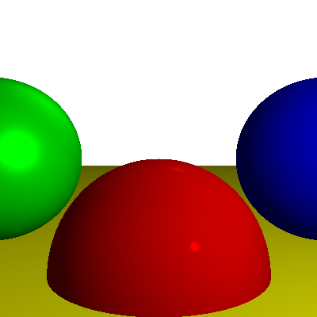
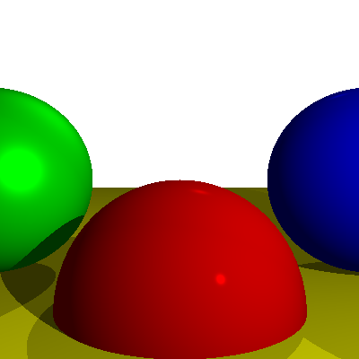

# luxst

### Motivation
luxst is a 3D ray tracer implemented in Rust, for fun

### Render progression

    <table>
        <tr>
            <td> <i>basic scene</i></td>
            <td> <i>+ diffuse light</i></td>
            <td> <i>+ specular</i></td>
            <td> <i>+ shadows</i></td>
        </tr>
        <tr>
            <td> <i>+ reflections</i></td>
        </tr>
    </table>

##

TODO:
* [x] ~~lights~~
* [x] ~~better common module organization~~
* [x] ~~specular~~
* [x] ~~shadows~~
* [x] ~~reflections~~
* [ ] parallelization
* [ ] more to come...

### Math
* [ ] add diagrams
