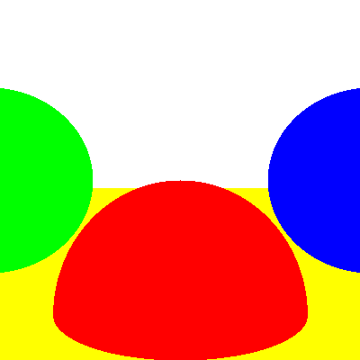
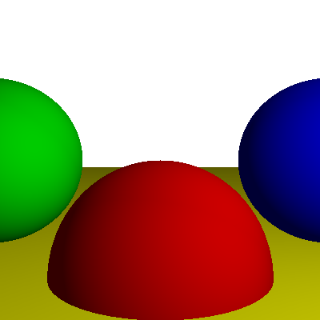

# Luxst

Luxst is a simple ray tracer implemented in Rust. It currently serves as an entrypoint into both computer graphics algorithms and the Rust language.

Basic ray-traced scene:

    

Add some lights and diffuse reflections:

    

##

TODO:
- [ ] lights
- [ ] reflections and shadows
- [ ] more to come...
